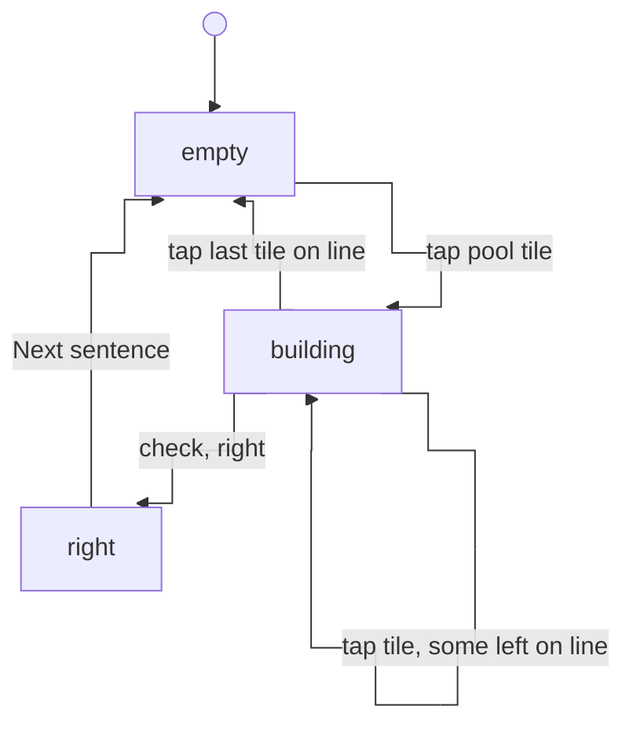
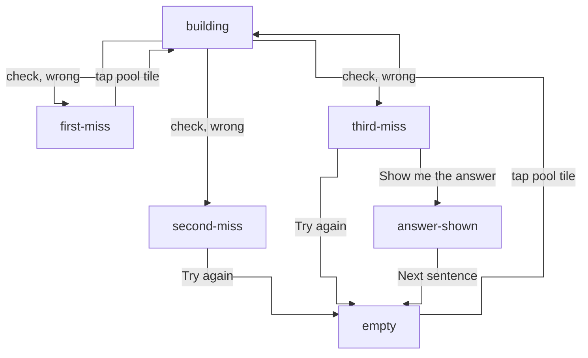
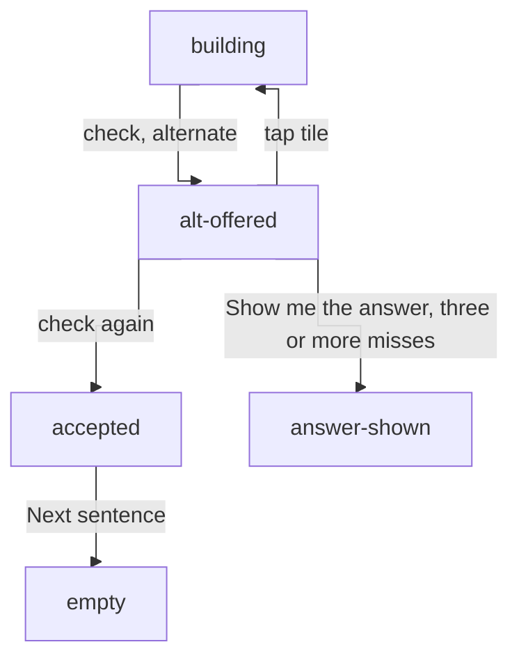
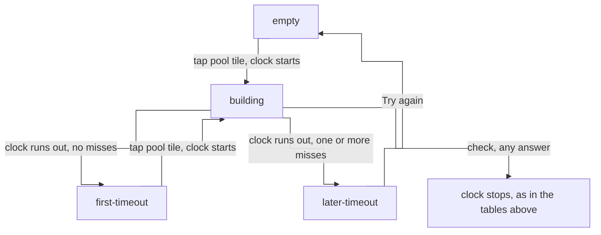

# Drill screen

[← README](../README.md)

What the drill (exercise) screen shows in each state, and which action moves it to which state. Update this in the same step as any change to the drill screen's behaviour.

- The states are split into groups, each with its own diagram and tables. A state named in more than one group is the same state.
- The mode chosen on the home screen, Free learning or Timed, shows under the prompt's "Say this in …" line in every state.

## Assumptions

The states below are written against these values. They are expected to change; if one does, the state names and transitions below need revisiting too.

| Assumption | Current value | Set in |
| --- | --- | --- |
| Wrong checks before the grammar tip is shown | 2 | `NOTE_AFTER_MISSES` in [config.ts](../src/config.ts) |
| Wrong checks before incorrect tiles are marked | 2 | `HIGHLIGHT_AFTER_MISSES` in [config.ts](../src/config.ts) |
| Wrong checks before "Show me the answer" is shown | 3 | `REVEAL_AFTER_MISSES` in [config.ts](../src/config.ts) |
| Wrong checks that clear the line instead of leaving it marked | 1 | hard-coded in `miss` in [appReducer.ts](../src/state/appReducer.ts) |
| Length of the timed-mode clock | not listed, still being tuned | the `limit` on each `tick` action |

## Answering

Building an answer and getting it right.

| State | Action button | Incorrect tiles marked | Tiles clickable | Message | Grammar tip | Show answer | Answer shown |
| --- | --- | --- | --- | --- | --- | --- | --- |
| `empty` | Check, disabled | n/a | yes | none | hidden | hidden | no |
| `building` | Check, enabled | n/a | yes | none | hidden | hidden | no |
| `right` | Next sentence or Finish set, enabled | n/a | no | correct | visible, "additional grammar tips" | hidden | yes |

- The action button reads Finish set instead of Next sentence on the last sentence of a set.
- After a miss, `empty` and `building` show the grammar tip and Show answer as in [the miss table](#missed-answers).

| From | Action | To |
| --- | --- | --- |
| start of a sentence | load | `empty` |
| `empty` | tap a tile in the pool | `building` |
| `building` | tap a tile in the pool | `building` |
| `building` | tap a tile on the answer line, tiles still on the line | `building` |
| `building` | tap a tile on the answer line, no tiles left on the line | `empty` |
| `building`, no misses | check, right answer | `right` |
| `building`, after one, two or three misses | check, right answer | `right` |
| `right` | Next sentence | `empty`, on the next sentence |

## Missed answers

Each wrong check adds a miss. The miss count, not the state, decides what help is on screen, and that help stays for the rest of the sentence.

| Misses | What the wrong check does to the line | Incorrect tiles marked | Grammar tip | Show answer | Message |
| --- | --- | --- | --- | --- | --- |
| 1 | clears it | no | hidden | hidden | not quite - try again |
| 2 | leaves it standing until Try again | yes | visible, "grammar" | hidden | not yet - read the note |
| 3 | leaves it standing until Try again | yes | visible, "grammar" | visible | not yet - read the note |
| 4 or more | same as 3 | same as 3 | same as 3 | same as 3 | same as 3 |

- once shown, the grammar tip and Show answer stay visible in `building`, `retrying` and `alt-offered` too, not just straight after the wrong check.

| State | Action button | Incorrect tiles marked | Tiles clickable | Message | Grammar tip | Show answer | Answer shown |
| --- | --- | --- | --- | --- | --- | --- | --- |
| `first-miss` | Check, disabled | no | yes | not quite - try again | hidden | hidden | no |
| `second-miss` | Try again, enabled | yes | no | not yet - read the note | visible, "grammar" | hidden | no |
| `third-miss` | Try again, enabled | yes | no | not yet - read the note | visible, "grammar" | visible | no |
| `answer-shown` | Next sentence or Finish set, enabled | n/a | no | answer shown | visible, "additional grammar tips" | hidden | yes |

- `empty` and `first-miss` both have nothing on the answer line; they differ only in the message.

| From | Action | To |
| --- | --- | --- |
| `building`, no misses | check, wrong answer | `first-miss` |
| `building`, one miss | check, wrong answer | `second-miss` |
| `second-miss` | Try again | `empty` |
| `building`, two misses | check, wrong answer | `third-miss` |
| `third-miss` | Show me the answer | `answer-shown` |
| `first-miss` | tap a tile in the pool | `building`, message cleared |
| `building`, three or more misses | check, wrong answer | `third-miss` |
| `third-miss` | Try again | `empty`, Show answer still visible |
| `empty` or `building`, three or more misses | Show me the answer | `answer-shown` |
| `answer-shown` | Next sentence | `empty`, on the next sentence |

## Alternate answers

A sentence can accept phrasings other than the one being taught. An alternate is offered first and only accepted on a second check.

| State | Action button | Incorrect tiles marked | Tiles clickable | Message | Grammar tip | Show answer | Answer shown |
| --- | --- | --- | --- | --- | --- | --- | --- |
| `alt-offered` | Check, enabled | no | yes | acceptable, but there is more natural phrasing - retry or tap check to continue | as for the miss count | as for the miss count | no |
| `accepted` | Next sentence or Finish set, enabled | n/a | no | accepted | visible, "additional grammar tips" | hidden | learner's answer with primary answer shown above it |

- an alternate doesn't count as a miss, so the miss count carries through `alt-offered` unchanged.

| From | Action | To |
| --- | --- | --- |
| `building` | check, alternate answer | `alt-offered` |
| `alt-offered` | check again, no tiles changed | `accepted` |
| `alt-offered` | tap a tile in the pool or on the line | `building`, or `empty` if the line is emptied |
| `alt-offered`, three or more misses | Show me the answer | `answer-shown` |
| `accepted` | Next sentence | `empty`, on the next sentence |

## Timed mode

Everything above still applies, with a clock on each attempt. The first tile tapped in `empty` starts it, and any Check stops it. If it runs out first, that counts as a miss, like a wrong check.

- the clock keeps running while tiles are tapped on and off, including back to `empty`.
- a timeout adds to the miss count, so the grammar tip and Show answer appear as in [the miss table](#missed-answers).
- tiles left on the line after a timeout are not marked.

| State | Action button | Incorrect tiles marked | Tiles clickable | Message | Grammar tip | Show answer | Answer shown |
| --- | --- | --- | --- | --- | --- | --- | --- |
| `first-timeout` | Check, disabled | no | yes | time ran out | as for the miss count | as for the miss count | no |
| `later-timeout` | Try again, enabled | no | no | time ran out | as for the miss count | as for the miss count | no |

| From | Action | To | Status |
| --- | --- | --- | --- |
| `empty`, clock stopped | tap a tile in the pool | `building`, clock starts | needs review |
| `building`, no misses | clock runs out | `first-timeout` | needs review |
| `building`, one or more misses | clock runs out | `later-timeout` | needs review |
| `first-timeout` | tap a tile in the pool | `building`, clock starts | needs review |
| `later-timeout` | Try again | `empty`, clock stopped | needs review |
| `building` | check, any answer | as in the tables above, clock stopped | needs review |
| any timed state | ← All | home screen, clock stopped | needs review |

## Sentences without a grammar note

Everything above applies, except:

- the grammar tip is never shown, in any state.
- a wrong check always reads "not quite - try again", even where the tables say "not yet - read the note".

## Finishing and leaving

| From | Action | To |
| --- | --- | --- |
| `right`, `accepted` or `answer-shown`, last sentence | Finish set | done screen |
| done screen | Practise this set again | `empty`, on the first sentence, score reset |
| done screen | Choose another situation | home screen |
| any drill state | ← All | home screen |
| home screen | open a situation, including the one just left | `empty`, on the first sentence, score reset |

## How the code names these

The states above are screen snapshots; the code holds them as `status`, `misses` and `placed` in `AppState` ([appReducer.ts](../src/state/appReducer.ts)). The thresholds are dials in [config.ts](../src/config.ts). Timed mode adds `mode`, `clockRunning` and `elapsed`, which count on the clock without changing which state is showing.

| State | `status` | `misses` | `placed` |
| --- | --- | --- | --- |
| `empty` | `idle` | any | empty |
| `building` | `idle` | any | not empty |
| `right` | `right` | any | the answer |
| `first-miss` | `wrong` | below `HIGHLIGHT_AFTER_MISSES` | empty |
| `second-miss` | `wrong` | at least `HIGHLIGHT_AFTER_MISSES`, below `REVEAL_AFTER_MISSES` | not empty |
| `third-miss` | `wrong` | at least `REVEAL_AFTER_MISSES` | not empty |
| `answer-shown` | `shown` | at least `REVEAL_AFTER_MISSES` | the answer |
| `alt-offered` | `alt` | any | not empty |
| `accepted` | `accepted` | any | the learner's alternate |
| `first-timeout` | `timeout` | 1 | empty |
| `later-timeout` | `timeout` | at least 2 | not empty |
