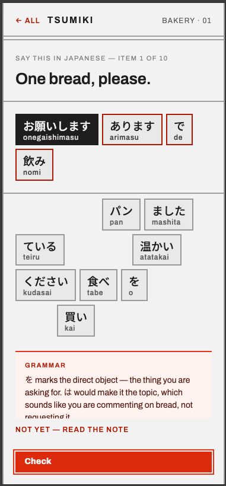

# Test Plan: BUG: Highlighting right/wrong tiles

## 1. What's Being Tested

*One sentence: what was broken, and under what condition did it happen?*

> Recently functionality was added to highlight wrong tiles for a second guess at a correct response. However, the process was not well tested by the human. On the second failed attempt, the screen shows as follows.

---

## 2. Why It Matters / Risk

*One or two sentences: what does the user actually experience if this is wrong? Why is this worth testing specifically, versus something else in the app?*

The main action button says "check" but tiles are still in the selected pool.
- The tile pool is not reset, which means it is not ready for the next attempt.
- It is not clear on how to proceed with the exercise.
- The user is likely confused on what to do next.

---

## 3. What Else Might Be Affected

*List any other app areas, features, or functions that share code, data, or state with this bug/feature — the places a fix or change here could cause a ripple effect elsewhere, even if you don't expect it to.*

This should only affect the exercise screen and not the main scenario picking screen.

---

## 4. Test Cases and Pass-Fail

*List 3–5 cases. Include at least one happy-path case and at least one edge case. For a bug, include the exact original failing case plus 1–2 nearby variations. For a feature, pick cases deliberately: one normal input, one invalid/unexpected input, one boundary condition.*

| # | Input / Action | Expected Result | Pass / Fail |
|---|-----------------|------------------|--------------|
| TC-0 | first attempt just failed, three failed attempts required to see "show answer" button | see disabled button say "Check", tiles reset to initial state | |
| TC-0 | second attempt just failed, three failed attempts required to see "show answer" button | see button say "Try again", and right/wrong tiles highlighted | |
| TC-0 | second attempt just failed, three failed attempts required to see "show answer" button, and the exercise has "alt" answers | see button say "Try again", and right/wrong tiles highlighted, but only for the main answer, not the "alt" answer | |
| TC-0 | second attempt failed, user tries to click any tiles | nothing happens | |
| TC-0 | second attempt failed, user clicks "try again" | tiles reset to initial state for third attempt | |
| TC-0 | third attempt just failed, again three failed attempts required to see "show answer" button | see two buttons that say "show answer" and "try again" and right/wrong tiles highlighted | |
| TC-0 | third attempt failed, user clicks "try again" | tiles reset to initial state for fourth attempt | |
| TC-0 | third attempt failed, user clicks "show answer" | answer shown, action button says "next sentence" | |
| TC-0 | any number of failed attempts after third attempt, which shows "show answer" button | same behavior as third attempt | |

---

## 5. Takeaway

*One or two sentences: what did this confirm? If you had more time, what would you test next?*

This covers actions taken upon a wrong response and highlighting wrong tiles.
